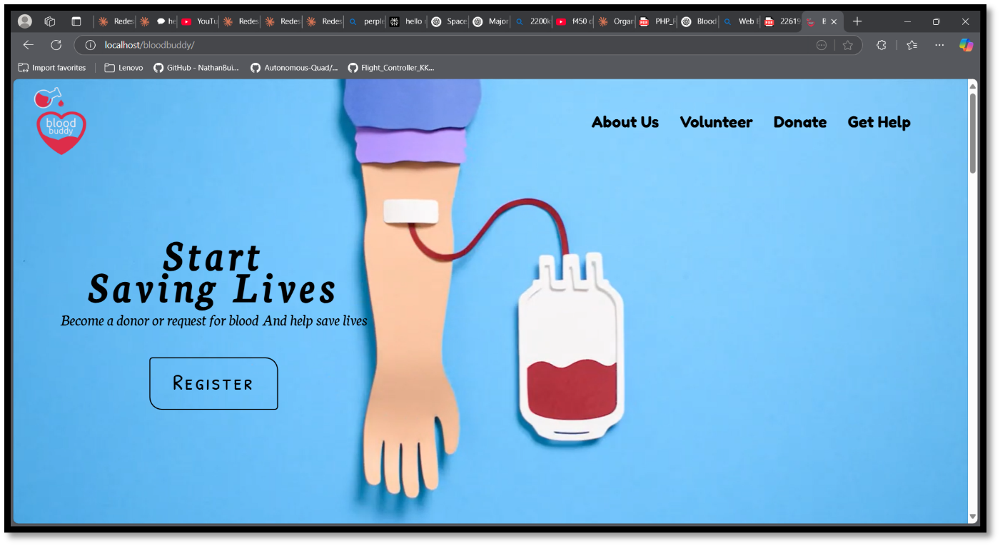
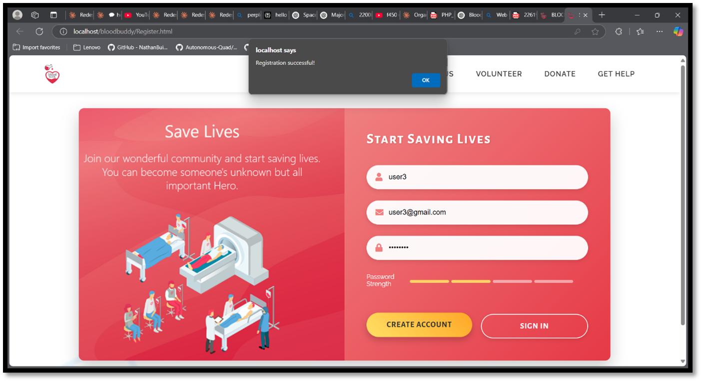
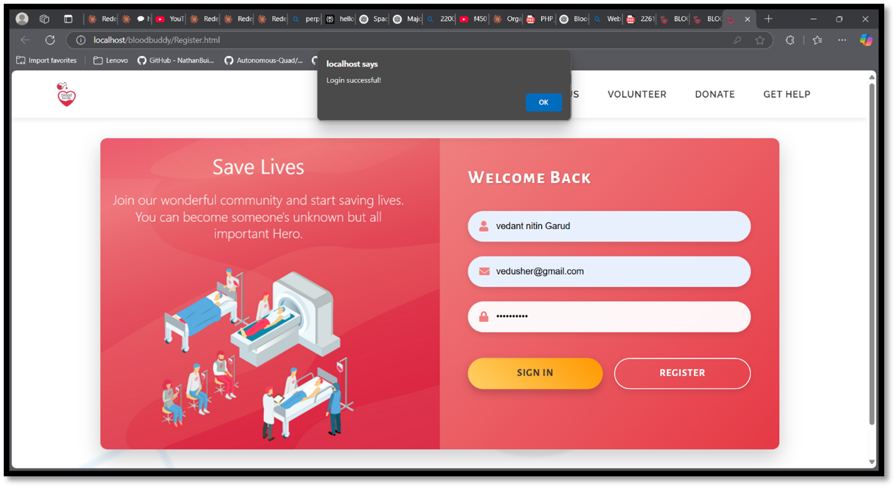
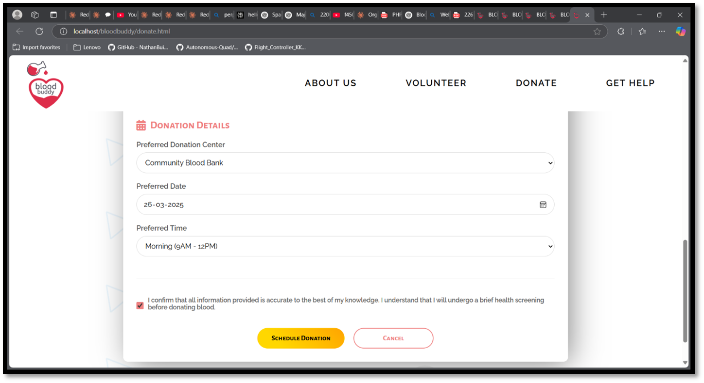
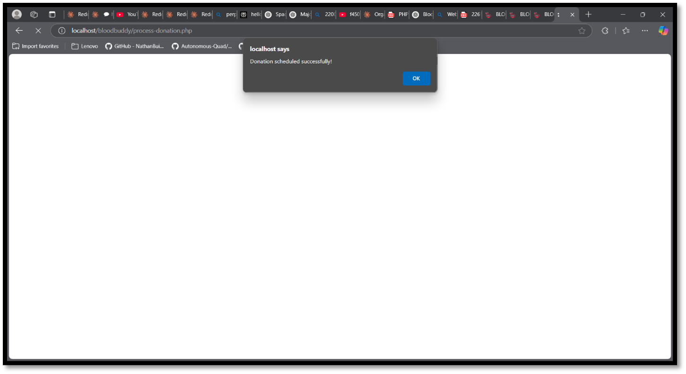
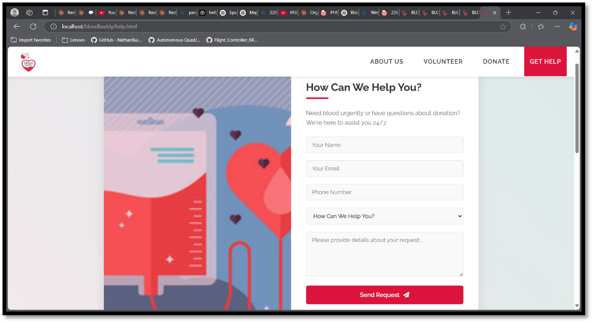
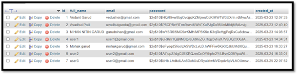
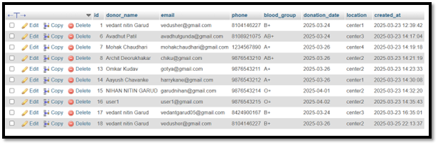
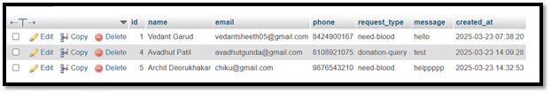

# Blood-Buddy

## 🩸 A Web-Based Blood Donation Management System

**Blood-Buddy** is a web-based application built using **PHP and MySQL** that connects blood donors with patients in need.

The platform simplifies the blood donation process by enabling users to:

- Register as donors  
- Schedule blood donations  
- Request emergency blood help  
- Manage donor data through a database  

The system aims to **reduce delays in emergency blood availability** and create an efficient connection between **donors, patients, hospitals, and blood banks**.

---

# 🚑 Problem Statement

Every year thousands of lives are lost because patients cannot find blood donors in time.

Common problems include:

- Lack of real-time donor availability  
- Poor communication between donors and patients  
- Outdated blood bank databases  
- Emergency situations where quick matching is required  

**Blood-Buddy** solves this by providing a **centralized digital platform for blood donation management**.

---

# ✨ Features

- User Registration System  
- Secure Login Authentication  
- Blood Donation Appointment Scheduling  
- Emergency Blood Help Requests  
- MySQL Database Integration  
- Form Validation & Error Handling  
- Secure Password Hashing (`password_hash`)  
- Clean and Simple UI  

---

# 🛠 Tech Stack

| Technology | Purpose |
|-----------|--------|
| **HTML** | Page structure |
| **CSS** | Styling |
| **JavaScript** | Client-side interaction |
| **PHP** | Server-side logic |
| **MySQL** | Database management |
| **XAMPP** | Local development environment |

---

# 📸 Screenshots

## 🏠 Home Page


## 👤 User Registration


## 🔐 User Login


## 🩸 Schedule Blood Donation


## ✅ Donation Confirmation


## 🆘 Help Request Section


---

# 🗄 Database Tables

## Users Table


## Donations Table


## Help Requests Table


---

# 📂 Project Structure

```
BLOOD-DONATE-V1/
│
├── Images/
│
├── screenshots/
│   ├── confirmation.png
│   ├── db_donations.png
│   ├── db_help.png
│   ├── db_users.png
│   ├── donation.png
│   ├── help.png
│   ├── home.png
│   ├── login.png
│   └── register.png
│
├── video/
│
├── donate.html
├── donate.css
├── Donate.js
│
├── help.html
├── help.css
├── help.js
│
├── index.html
├── index.css
│
├── Register.html
├── Register.css
├── Register.js
│
├── login.php
│
├── process-donation.php
├── process-help.php
├── process-registration.php
│
├── scroll.js
├── up.js
│
├── pre-loader.svg
│
└── README.md
```

---

### Structure Explanation

| Folder / File | Description |
|---------------|-------------|
| `index.html` | Main homepage of the Blood-Buddy platform |
| `index.css` | Styling for the homepage |
| `Register.html` | User registration page |
| `Register.js` | Handles registration form logic and validation |
| `Register.css` | Styles for registration page |
| `login.php` | Handles user login authentication |
| `donate.html` | Blood donation scheduling page |
| `Donate.js` | Handles donation form functionality |
| `donate.css` | Styles for donation page |
| `help.html` | Emergency blood help request page |
| `help.js` | Handles help request form logic |
| `help.css` | Styles for help request page |
| `process-registration.php` | Processes user registration and stores data in database |
| `process-donation.php` | Processes blood donation scheduling requests |
| `process-help.php` | Processes emergency blood help requests |
| `scroll.js` | Handles smooth scrolling effects |
| `up.js` | Implements scroll-to-top functionality |
| `pre-loader.svg` | Preloader animation for page loading |
| `Images/` | Stores website images and assets |
| `screenshots/` | Images used for README documentation |
| `video/` | Contains project demo videos |
| `README.md` | Project documentation |

---

# ⚙️ How the System Works

## 1️⃣ User Registration

Users create an account by submitting:

- Full Name  
- Email  
- Password  

Passwords are securely hashed using PHP.

```php
$hashedPassword = password_hash($password, PASSWORD_DEFAULT);
```

The system also checks if the email already exists before registration.

---

## 🔐 Login Authentication

Users log in using their registered credentials.

The system verifies passwords using:

```php
password_verify($password, $user['password']);
```

If valid, a **session is created for the user**.

---

## 🩸 Donation Scheduling

Donors can schedule blood donations by submitting:

- Name  
- Email  
- Phone Number  
- Blood Group  
- Donation Date  
- Donation Center  

The information is stored in the **donations database table**.

---

## 🆘 Emergency Help Requests

Patients can request urgent blood help by filling a form with:

- Name  
- Email  
- Phone  
- Request Type  
- Message  

The request is stored in the **help_requests table** for processing.

---

# 🗄 Database Structure

## Users Table

| Field | Type |
|------|------|
| id | INT |
| full_name | VARCHAR |
| email | VARCHAR |
| password | VARCHAR |
| created_at | TIMESTAMP |

---

## Donations Table

| Field | Type |
|------|------|
| id | INT |
| donor_name | VARCHAR |
| email | VARCHAR |
| phone | VARCHAR |
| blood_group | VARCHAR |
| donation_date | DATE |
| location | VARCHAR |

---

## Help Requests Table

| Field | Type |
|------|------|
| id | INT |
| name | VARCHAR |
| email | VARCHAR |
| phone | VARCHAR |
| request_type | VARCHAR |
| message | TEXT |

---

# 🧠 Skills Demonstrated

- Full Stack Web Development  
- PHP Backend Programming  
- MySQL Database Design  
- Secure Authentication Systems  
- Form Validation & Error Handling  
- Server-Side Data Processing  

---

# 🌍 Real World Applications

- 🏥 Hospitals can manage donor databases  
- 🩸 Blood banks can track donations  
- 🚑 Emergency patients can quickly find donors  
- 🤝 NGOs can organize blood donation drives  

---
